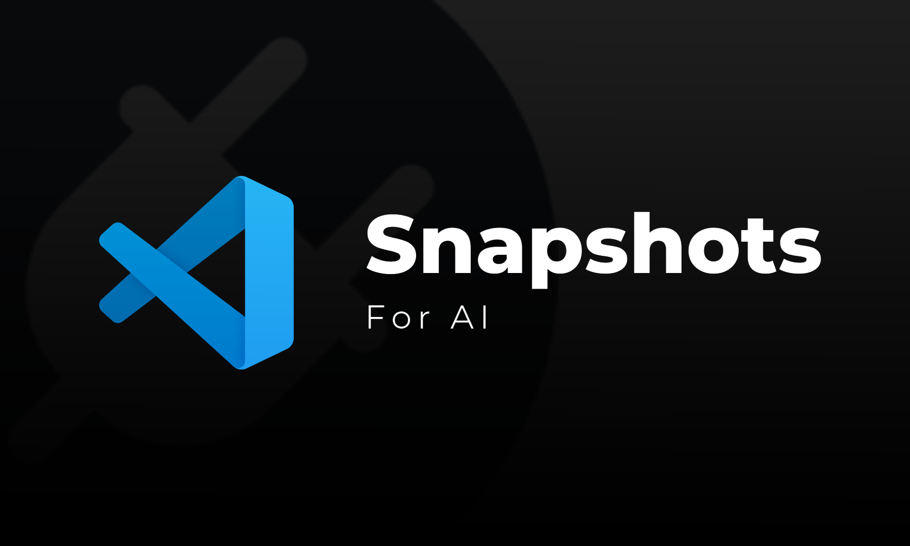
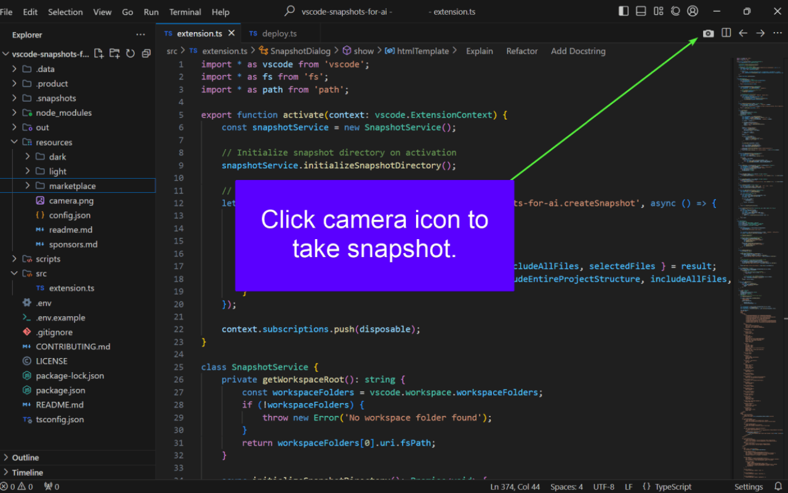
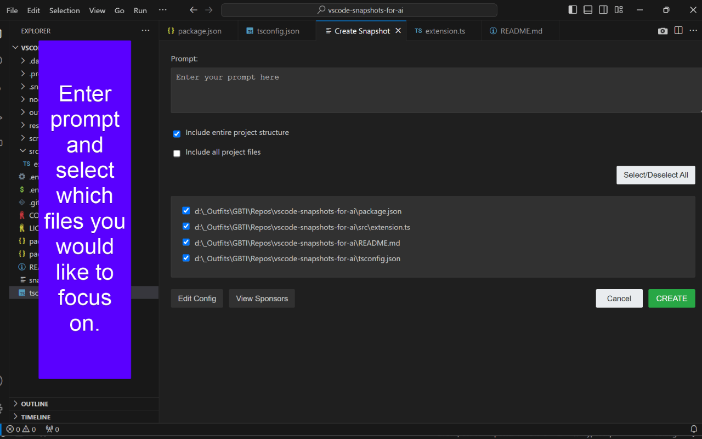
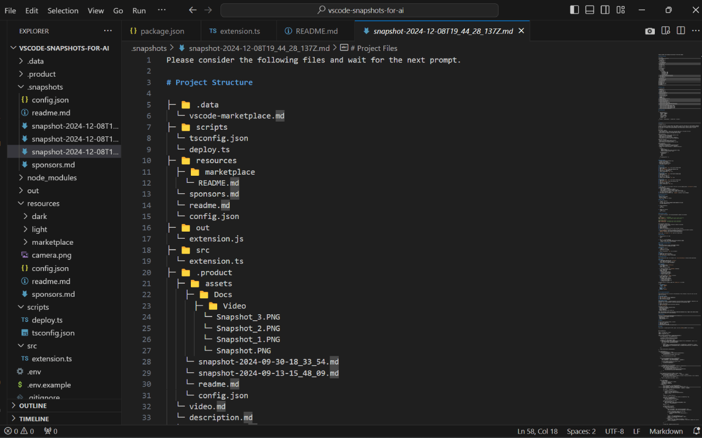
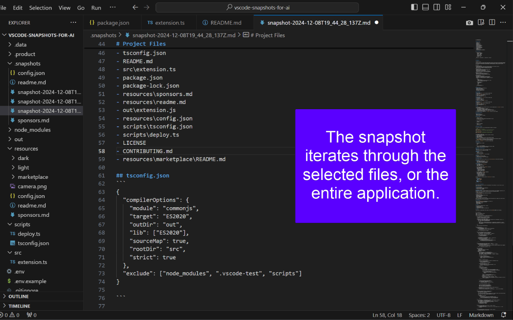
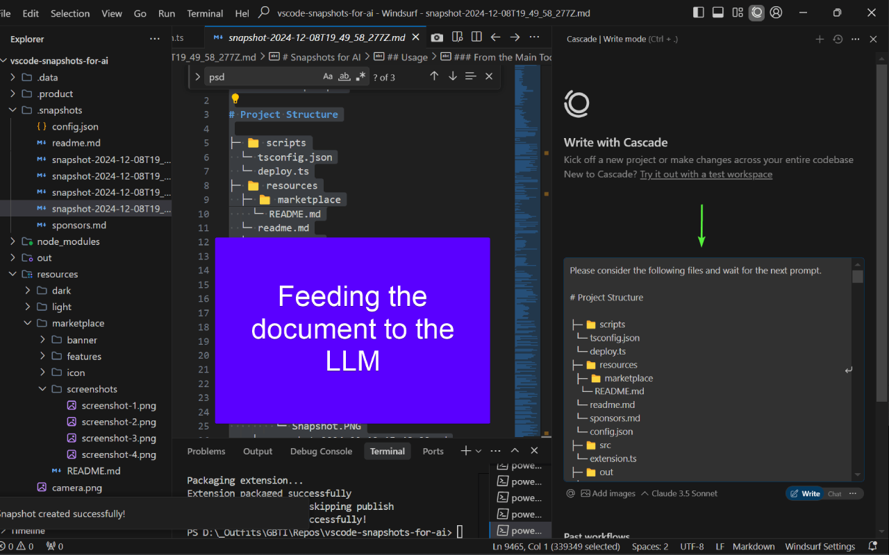
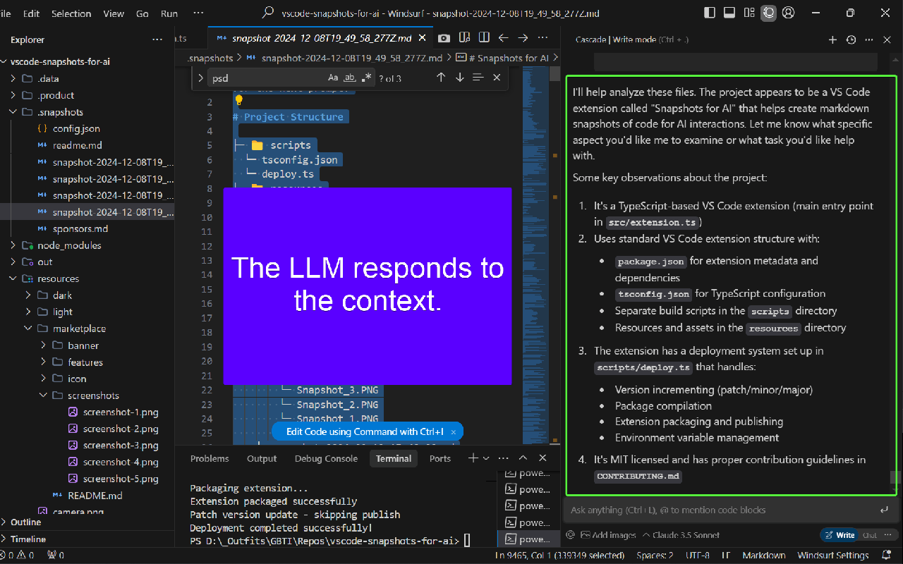

Topics Covered in This Article:
- The problem of LLM context management
- The rise of flowstate code editors
- High-level theory and RAG-like approach
- Why markdown is the ideal format for LLM context
- Use cases and practical applications
- Announcement of VS Code extension availability
- Key features and capabilities
- Transition from PhpStorm plugin to VS Code extension
- Conversion from Java to TypeScript with Windsurf's help
- Integration with Open VSX Registry and Windsurf IDE
- Removal of freemium model in response to market changes
- Addition of sponsors button for community support
- Repository links and source code access
- Configuration and support options
- Opening of GBTI Network membership
- Community engagement and growth opportunities
- Installation and getting started guide

---

# Announcing Snapshots for AI: Now Available for VS Code!

## The Challenge of LLM Context Management

Picture this: You're deep in the trenches of a complex project, working alongside your AI assistant. As the hours tick by, you notice your AI companion starting to fumble - suggesting solutions you've already tried, referencing outdated code, or even proposing changes that would reintroduce previously fixed bugs. This is the harsh reality of LLM context loss.

## The Rise of Flowstate Code Editors

The development landscape is undergoing a significant transformation with the emergence of AI-powered flowstate code editors. Tools like Cursor have pioneered this space, while newcomers like Windsurf and Cognition Labs' Devin are pushing the boundaries even further. These editors are redefining how developers interact with their code, offering seamless AI integration and context-aware assistance.

## Snapshots for AI: Bridging the Context Gap

While true Retrieval-Augmented Generation (RAG) systems offer powerful capabilities, they often require complex infrastructure and can be costly to implement. Snapshots for AI takes a different approach, providing a lightweight yet effective solution for maintaining LLM context in development workflows.

Our approach is simple but powerful: generate clean, well-structured markdown snapshots of your code that can be directly fed to any LLM. This gives you:

- **Selective Context Control**: Choose exactly which files and code segments to include, avoiding the overhead of processing entire codebases
- **Universal Compatibility**: Works with any LLM service - from ChatGPT to Claude to local models
- **Cost-Effective Implementation**: No need for expensive API calls or complex vector databases
- **Immediate Integration**: Start using it immediately with your existing LLM tools and workflows

## Why Markdown Matters

In the world of LLM-assisted development, the choice of format for context sharing is crucial. Markdown has emerged as the ideal medium for several compelling reasons:

### Universal Readability
- Human-readable while maintaining structure
- Supported by virtually all LLMs
- Preserves code formatting and syntax highlighting

### Context Preservation
- Maintains file relationships and project structure
- Supports hierarchical organization
- Allows for inline documentation and metadata

### Optimal Token Usage
- Efficient representation of code context
- Minimal overhead compared to other formats
- Better token economy for API-based LLM interactions

## Practical Use Cases

Snapshots for AI shines in various development scenarios:

### Debugging Unfamiliar Languages
When working with a new language or framework, provide your AI assistant with precise context about compile errors and implementation details.

### Long-Running Development Sessions
Start fresh AI sessions without losing context - quickly bring your AI assistant up to speed with your current environment and code state.

### Code Refactoring and Improvement
Partner with your AI assistant for both quick development of small applications and thoughtful refactoring of larger codebases.

### Documentation and Knowledge Transfer
Create clear, context-rich documentation for team members or future reference, with all relevant code relationships preserved.

## Introducing the VS Code Extension

Check out our [quick demo video](https://youtu.be/0xXCoZJbTpw) to see it in action!

We're excited to announce that our popular Snapshots for AI extension is now available for Visual Studio Code! Originally developed as a PhpStorm plugin, we've successfully ported and enhanced this tool to serve the VS Code community.

## Key Features

Our VS Code extension brings all the power of Snapshots for AI to your favorite editor:

### One-Click Snapshots
- Create snapshots instantly using the camera icon in your editor
- Automatically formats code with proper syntax highlighting
- Includes file structure and relevant context

### Smart Selection
- Choose specific files or include entire project structure
- Real-time file list updates as you work
- Intelligent filtering of binary and irrelevant files

### Perfect Formatting
- Generates clean, well-structured markdown
- Proper syntax highlighting for all languages
- Hierarchical project structure visualization

### AI-Ready Output
- Creates context-rich snapshots optimized for AI consumption
- Perfect for RAG (Retrieval Augmented Generation)
- Works with all major AI assistants

## From PhpStorm to VS Code: A Seamless Transition

With the incredible support of Windsurf, we've transformed our Java-based [PhpStorm plugin](https://plugins.jetbrains.com/plugin/24889-snapshots-for-ai) into a TypeScript-powered VS Code extension. The transition was remarkably smooth, allowing us to maintain all the core functionality while adapting to VS Code's ecosystem.

## Powered by TypeScript and Windsurf

The conversion from Java to TypeScript wasn't just a technical necessity - it was an opportunity to enhance and streamline our codebase. Windsurf's expertise in TypeScript and VS Code extension development made this transition seamless and efficient.

## Integration with Open VSX Registry and Windsurf IDE

We're particularly excited about our integration with Windsurf through the Open VSX Registry. Our extension is now available at [open-vsx.org/extension/GBTI/snapshots-for-ai](https://open-vsx.org/extension/GBTI/snapshots-for-ai), making it seamlessly accessible to Windsurf users. This integration is especially meaningful as Windsurf leverages the Open VSX Registry to curate its marketplace of available extensions.

## Embracing Open Source

We've removed all freemium restrictions, making the VS Code extension completely free. This decision reflects our understanding that in a world where premium AI-powered editors are becoming the norm, developers shouldn't have to pay extra for supplementary RAG tools.

## Supporting the Community Through Sponsorship

Instead of charging for premium features, we've added a sponsors button that allows users to support the GBTI network in various ways, aligning with the true spirit of open source collaboration.

## Source Code and Documentation

You can find the source code for both versions on GitHub:
- [VS Code Extension](https://github.com/gbti-network/vscode-snapshots-for-ai)
- [PhpStorm Plugin](https://github.com/gbti-network/phpstorm-snapshots-for-ai)

## Configuration and Support

The extension is highly configurable through `.snapshots/config.json`, allowing you to customize:
- Default prompts
- Project structure inclusion
- File patterns to include/exclude
- And more!

For support or to report issues:
- Visit our [GitHub Issues](https://github.com/gbti-network/vscode-snapshots-for-ai/issues)
- Join our community discussions
- Check out our documentation

## Join the GBTI Network

We're thrilled to announce that the GBTI Network is now accepting new members! This is an exciting opportunity to become part of a growing community of developers and innovators. Visit our [membership page](https://gbti.network/membership/) to learn more about the benefits and application process.

## Community Engagement

The GBTI Network is more than just a platform – it's a community of passionate developers and innovators. Check out our [members directory](https://gbti.network/members/) to connect with fellow professionals and consider becoming part of our growing network.

## Get Started Today

Ready to try Snapshots for AI? Install it from the VS Code marketplace or Open VSX Registry and start creating perfect code context for your AI interactions. The extension is completely free, and your support through sponsorship helps us continue developing tools that make developers' lives easier.
